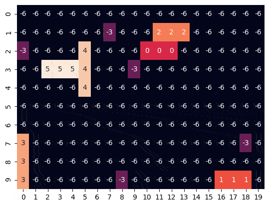
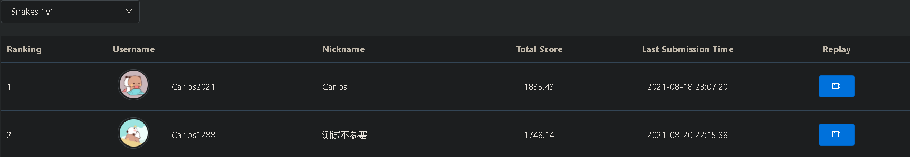
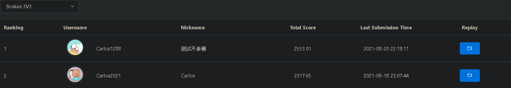
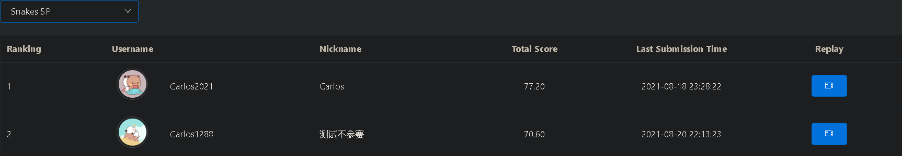

# Competition_3v3snakes

Demo heuristic algorithm of [snakes 3V3](http://www.jidiai.cn/snakes) on [Jidi](http://www.jidiai.cn/) platform. Also suitable for [snakes 1V1](http://www.jidiai.cn/snakes1v1), [snakes 2P](http://www.jidiai.cn/snakes2p) and [snakes 5P](http://www.jidiai.cn/snakes5p). For algorithm details, see [Jidi Snakes 3V3](https://www.yuchen.xyz/2021/08/21/2021-08-21-jidi-snakes-3v3/).

# Getting Started

## Debug

`/agent/debug/submission.py` is used to debug.

Run `python run_log.py --my_ai "debug" --opponent "debug" > output.txt` and wait for one minute.

Check `output.txt` in main directory, game matrix images in `/images_init_board` and territory matrix images in `/images_board`.

## Submit

Migrate your modification to `/agent/submit/submission.py` and submit.

You can directly make a submission on [snakes 1V1](http://www.jidiai.cn/snakes1v1), [snakes 3V3](http://www.jidiai.cn/snakes) and [snakes 5P](http://www.jidiai.cn/snakes5p).

If you want to submit on [snakes 2P](http://www.jidiai.cn/snakes2p), remember to change the variable `teams` to `[[0, 1]]`.

Then you can get a ranking slightly below that

# Acknowledgments

[jidiai/Competition_3v3snakes](https://github.com/jidiai/Competition_3v3snakes)

